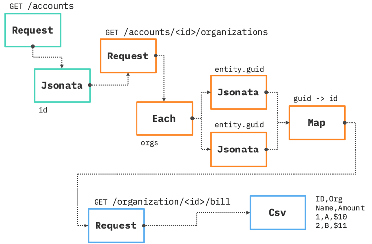

# JSONetl

Jsonetl is an approach to modeling an extract-transform-load pipeline as OpenWhisk Functions. Functions themselves are often succinct and highly parallelized. This makes them ideal for efficient, on-demand batch processing of data. Unfortunately, a need arises to manipulate data (the transform stage). While it may be easy for a developer to write a simple function, doing so in an ad hoc manner reduces re-usability and leads to more code writing.

## Typical scenario

Consider a scenario where billing data is retrieved from a series of APIs. In a RESTful system, example models might be: `account`, `organization`, `user`, `bill`, and `line_item`. Thus a typical interaction might be:
1. `GET /account` returns a JSON object with your account `id`.
2. `GET /account/${id}/organizations` returns an array of JSON objects with more data.
3. For each organization object, you `GET /organization/${id}/bill` to get a billing object.
4. And for each `line_item` in the bill you might make note of the `user` in case it requires investigations.

The business need is essentially a chain of API calls with proper inputs and outputs. It's also a need that is likely well addressed by some enterprise service bus or similar software. But the developer is also likely to remark, "This is pretty basic so I'll write it myself."

Ultimately, the scenario - whether it's billing or another use case - has a common set of core functions.
1. Make a request (i.e. GET or POST) to an API.
2. Fetch data such as the `id` to be used in the next step.
3. Make another request.
4. Change the data to support the next step in the pipeline. For example, change and object's `id` to be `accountId`.
5. Process multiple entities (i.e. an array), each of which might call its own pipeline.
6. Output the result to a file or cloud object storage.

## Modeling as functions

The business scenario and technical underpinning can be easily modeled as functions. Functions inherently support the concept of a pipeline as they already follow a flow-based programming model. Each step in the business process is modeled as an OpenWhisk **Action**. For every Action, there is an input and output object. And Actions can be chained together into a **Sequence**, which passes the input/output data along. All that's left is to include metadata in the form of **Parameters** that provide instructions used by the Actions. Visually, it looks like this.



- Each **Action** is denoted by a rectangle.
- The text in the box is the code being executed (more on that later).
- The text above the box is the **Parameter(s)** used by the Action. It can be statically defined by the user or dynamic based on what the previous Action sends downstream.
- For each Action, there is a connecting line indicating that the output of one action becomes the input of another. The different colors of the boxes logically group different types of processes. For example, the teal color might be the `GetAccounts` use case.
- Naming and connecting two or more actions creates a **Sequence**.
- Taken all together, they represent an application.

## Function list

To understand what's happening above and the value each step provides, review the functions available. Each function operates on an input object, which is the output object of a previous action. In addition to this data, you can declare input parameters of the form _*name*. These control how the function operates. They are prefixed with an underscore so they don't overwrite data from another function's output. Said differently, every function gets an object. The object is a combination of the data from the previous action with the parameters of the current action.

### Request

Makes an HTTP request by using Request and Request-Promise. Both are natively available on OpenWhisk. This returns a Promise. You can support variable substitution in the URL by passing an input object and declaring JSONata to create a replacement value. For example, passing the input object `{route: "foo" , _url: 'http://ibm.com/{{route}}'}` yields `http://ibm.com/foo` as the URL.

| Input | Description |
| --- | ---  |
| _url: string | The URL to request |
| _username?: string | A username if basic auth is to be used |
| _password?: string | A password if basic auth is to be used |
| _bearer?: string | A token if bearer authorization is to be used |
| _json?: boolean | True if the request/response is JSON |
| _method?: string | The HTTP method (e.g. GET or POST) |
| _body?: any | The body to POST if any |
| _jsonata?: any | JSONata applied to the response (this becomes the output of Request) |
| _retain?: boolean | Retains the original params in the response |

| Output | Description |
| --- | ---  |
| _data: any | Data returned will be assigned to this property and wrapped as an object |

### JSONata

Executes [JSONata](http://jsonata.org/) on the input object. Note that Functions must return an object but you can invoke the Jsonata action programatically and get the actual evaluation (e.g. an array or string). Try the [JSONata Exerciser](http://try.jsonata.org/) to see how flexible this one function can be for transforming data.

| Input | Description |
| --- | ---  |
| _jsonata: string | The JSONata expression to apply to the input object |
| _toObj?: boolean | Return the expression evaluation as an object - defaults to true |

| Output | Description |
| --- | ---  |
| _data: any | Data returned will be assigned to this property and wrapped as an object if `toObj` is set. Otherwise you'll get a Javascript primitive.|

### Each

Executes an OpenWhisk Action (or Sequence) on each object of an array. The array is not passed to Each - rather you'll provide a JSONata expression that evaluates to create an array after which Actions will be invoked. You can choose to call a Sequence to begin a new pipeline or call and individual Action that uses the result for an existing Sequence.

| Input | Description |
| --- | ---  |
| _path: string | The JSONata expression to locate the array from the input object |
| _action: string | The Action (or Sequence) to invoke |

| Output | Description |
| --- | ---  |
| _data: any | Data returned will be assigned to this property and wrapped as an object |

### Map

Maps properties to a new name. For example, you might map `id` to `accountId`. This is useful when the next Request body in the sequence expects the input to have a different property ID than what the upstream Request provided.

| Input | Description |
| --- | ---  |
| _input: string | A comma separated list of old property names to lookup |
| _output: string | A comma separated list of new property names to assign |
| _path?: string | The JSONata expression to locate the object to map |
| _delete?: boolean | Removes the original property - defaults to true |

| Output | Description |
| --- | ---  |
| any | Returns the original object with property updates |

### Pick
Creates an object that contains only whitelisted properties. The values are obtained from individual JSONata expressions.

| Input | Description |
| --- | ---  |
| _keys: string | Properties that will be included in the result object |
| _jsonatas: string | Comma-separated JSONatas that declare the value for a similarly indexed property |

| Output | Description |
| --- | ---  |
| any | Returns an object only the key value pairs |

### Stringify
Creates an object that converts whitelisted properties' values into strings. Keys must be at the top level, which is what most downstream Actions would also expect.

| Input | Description |
| --- | ---  |
| _keys: string | Properties that will be stringified in the result object |

| Output | Description |
| --- | ---  |
| any | Returns the original object with newly stringified values |

### Csv

Converts a JSON object to CSV.

| Input | Description |
| --- | ---  |
| _titles: string | A comma separated list of titles for the first row |
| _fields: string | A comma separated list JSONata expressions to locate the value |
| _path?: string | The JSONata expression to locate the array of objects that will become rows in the CSV |
| _delim?: string | The delimiter between values |
| _retain?: boolean | Retains the original params in the response |

| Output | Description |
| --- | ---  |
| _data: any | The CSV string will be assigned to this property and wrapped as an object |

## Assembling functions

The business process is assembled declaratively using [wskdeploy](https://github.com/apache/incubator-openwhisk-wskdeploy). Originally, wskdeploy was designed to be a utility for declaring and deploying functions to OpenWhisk. But by bundling the above functions as a package, they can be linked together in a manifest.yaml file to define a process flow.

### Creating a dependency

In your manifest.yaml file, you can declare a dependency on JSONetl.

```yaml
packages:
  your-awesome-process:
    version: 1.0
    license: Apache-2.0
    dependencies:
      jsonetl:
        location: github.com/van-ibm/openwhisk-jsonetl
```

This creates a dependency called `jsonetl` that will reference the functions code of this GitHub repo. After running `wskdeploy --preview` a new `Packages` directory will be added to your project. In it will be `jsonetl-master` directory that has all of the functions mentioned above.

### Referencing a function

To use a JSONetl function, you reference it as an Action. This is the exact same process you'd perform if you had created your own custom function. The difference is that the code is contained in the `jsonetl-master` package. Continuing with the previous manifest.yaml file, you add the following.

```yaml
    actions:
      orgs-request:
        function: Packages/jsonetl-master/dist/Request.js
        runtime: nodejs:8
        inputs:
          _url: https://api.ng.bluemix.net/v2/organizations?order-by=name
          _bearer: ${UAA_TOKEN}
      orgs-csv:
        function: Packages/jsonetl-master/dist/Csv.js
        runtime: nodejs:8
        inputs:
          _titles: Org Name,Org Status,Org Billing Enabled,Org GUID,Org Created,Org Updated
          _path: _data.resources
          _fields: entity.name,entity.status,entity.billing_enabled,metadata.guid,metadata.created_at,metadata.updated_at
```

The `orgs-request` Action will execute the `Request` function. The URL of that request is defined as the input `_url`. This is an example of a statically defined parameter. Since the API is protected, Bearer Authorization will be used by specifying the `_bearer` parameter. The actual value is obtained from the environment variable `UAA_TOKEN`, which would have been exported prior to running wskdeploy. `UAA_TOKEN` could also be supplied via the command line when invoking the action. For example, `ibmcloud wsk action invoke <someAction> -p UAA_TOKEN <token>`.

The `orgs-request` Action provides data. Shown are two of the 8 records. Notice how much nesting occurs with the data - an object wraps a `resources` array, of more objects - each of which has an `entity` and `metadata` object. This is why the developer falls back to code. Getting access to this data programmatically means writing `object.resources[0].entity.name` to obtain the value `AcmeCo`.

```javascript
{
  "_data": {
    "next_url": null,
    "prev_url": null,
    "resources": [
      {
        "entity": {
          "billing_enabled": false,
          "default_isolation_segment_guid": null,
          "name": "AcmeCo",
          "status": "active"
        },
        "metadata": {
          "created_at": "2015-10-28T18:22:20Z",
          "guid": "<guid>",
          "updated_at": "2016-10-20T00:58:29Z",
          "url": "/v2/organizations/<guid>"
        }
      },
      {
        "entity": {
          "billing_enabled": false,
          "default_isolation_segment_guid": null,
          "name": "AjaxCo",
          "private_domains_url": "/v2/organizations/<guid>/private_domains",
          "status": "active"
        },
        "metadata": {
          "created_at": "2018-03-16T10:18:56Z",
          "guid": "<guid>",
          "updated_at": "2018-08-08T13:56:02Z",
          "url": "/v2/organizations/<guid>"
        }
      }
    ],
    "total_pages": 1,
    "total_results": 8
  }
}
```

To provide easier access to the values like `AcmeCo` and `AjaxCo` for downstream usage, you can use the Jsonata function. It can be used directly as a Jsonata function or in the above example, indirectly in the `orgs-csv` action. The Csv function expects an array. To provide it, the `path: _data.resources` tells Csv where to look inside the input object. The `_data.resources` JSONata evaluates to the array seen at the `resources` property. It's equivalent to saying, "Go to the `_data` variable, then get return the `resources` variable inside." Then each comma separated JSONata expression in manifest.yaml's `_fields` property is applied to the objects in the array. The result is a CSV with the first row containing `_titles` and the following rows containing each objects' values. Notice how the final result combines the data from `entity` and `metadata`.

```csv
Org Name,Org Status,Org Billing Enabled,Org GUID,Org Created,Org Updated
AcmeCo,active,false,6e4e8fcc-adda-4371-a6fc-9833c4c5932f,2018-03-16T10:18:57Z,2018-03-16T10:18:58Z
AjaxCo,active,false,b8e2016a-fd71-4475-ae8b-07d522193a3a,2014-12-17T22:12:42Z,2018-08-01T16:04:01Z
```

To chain both actions together, you use a sequence in the manifest.yaml that references both actions.

```yaml
    sequences:
      orgs-seq:
        actions: orgs-request,orgs-csv
```

And invoke the sequence from the command `ibmcloud wsk action invoke cloud-functions-usage-examples/orgs-seq -r` to create the CSV result.

```javascript
{
  "_data": "Org Name,Org Status,Org Billing Enabled,Org GUID,Org Created,Org Updated\nAcmeCo,active,false,6e4e8fcc-adda-4371-a6fc-9833c4c5932f,2018-03-16T10:18:57Z,2018-03-16T10:18:58Z\nAjaxCo,active,false,b8e2016a-fd71-4475-ae8b-07d522193a3a,2014-12-17T22:12:42Z,2018-08-01T16:04:01Z"
}
```

Mixing and matching JSONetl functions with JSONata expressions makes data processing very flexible. Let's assume that all you wanted were the `names` of organizations for input into a function. You can create a JSONata action, with the following and simply insert it into a sequence.

```yaml
      resources:
        function: Packages/jsonetl-master/dist/Jsonata.js
        runtime: nodejs:8
        inputs:
          _jsonata: _data.resources.entity.name
```

This returns an object with the array of names.

```javascript
{
  "_data": ["AcmeCo" , "AjaxCo"]
}
```

## Issues and limitations

### Global variables
Assume that every Request you make will have the same authentication. You've created a sequence that chains together various Requests to the same system. Unfortunately, downstream Requests fail with an authentication error. The issue is that while the first Request may have been set with an Authorization header using `-p _bearer <token>` subsequent Requests will not receive it. This is because the original parameter was discarded somewhere along the way because a Map function doesn't know that it's supposed to pass this information along. The solution here is that you can declare `inputs` for the package and all actions will inherit them. The drawback is that these parameters are set at deployment time - not run time. The other aspect of this problem is that Request - being as generic as possible - just looks for a `_bearer` parameter. So there's no way to invoke a sequence AND say that the `-p _bearer <token>` is for Request1 and I want to use a different `_bearer` for Request2 in the same sequence.

### wskdeploy --preview
If you were to reference the JSONetl functions and attempt to `wskdeploy` it would fail. This is because wskdeploy will look for those function inside your project. They don't yet exist due to order of operations in wskdeploy. So you'll first need to execute `wskdeploy --preview` to download the packages and then follow with `wskdeploy`.

### Returning an Object versus an Object._data
Some functions return an object while others return an object with the data you want assigned to the `_data` property. Why? Since all OpenWhisk functions must return an object, there's a safeguard to prevent JSONata that returns an array or string from being returned and causing an error. So for situations when this could occur, the returned object will assign the Javascript primitive to the `_data` property.